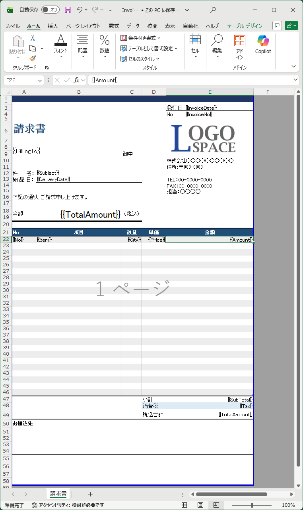
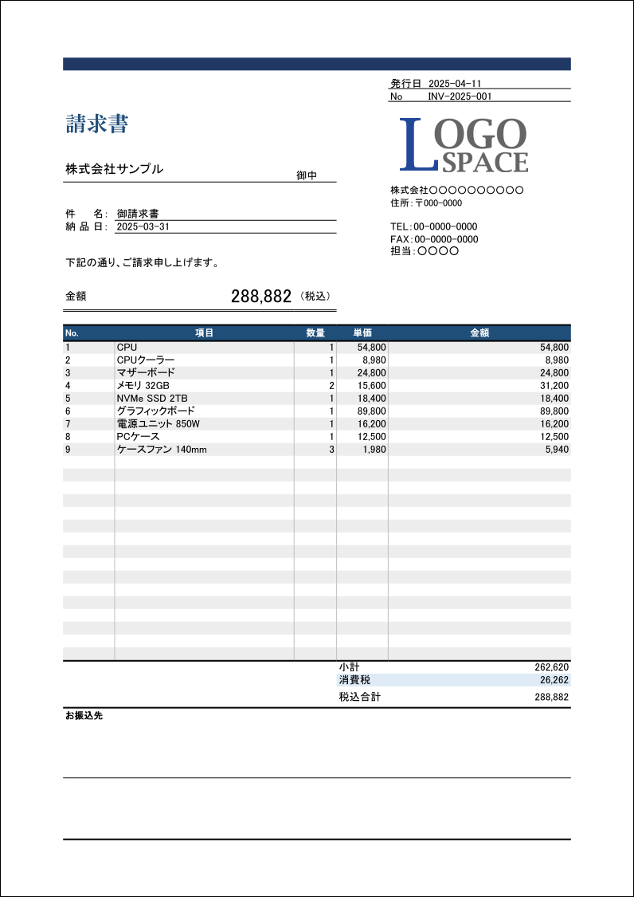

# OysterReport - Excel template to PDF converter

[](https://www.nuget.org/packages/OysterReport/)

## What is this?

A .NET library that converts Excel (.xlsx) templates to PDF.

| Excel |  | PDF |
| :---: | :---: | :---: |
|  | → |  |

## Quick Start

```csharp
var engine = new OysterReportEngine();

using var workbook = new TemplateWorkbook("Invoice.xlsx");
var sheet = workbook.GetSheet("Invoice");

// Replace simple placeholders
sheet.ReplacePlaceholder("CustomerName", "UsaUsa Corp");
sheet.ReplacePlaceholder("IssueDate", "2025-01-15");

// Expand a detail row
var templateRow = sheet.FindRow("ItemName");
var row = templateRow;
foreach (var item in items)
{
    row = templateRow.InsertCopyAfter(row);
    row.ReplacePlaceholders(new Dictionary<string, string?>
    {
        ["ItemName"] = item.Name,
        ["Amount"]   = item.Amount.ToString()
    });
}
templateRow.Delete();

using var output = File.Create("invoice.pdf");
engine.GeneratePdf(workbook, output);
```

## Supported features

| Category | Detail |
|---|---|
| **Font** | Size, Bold/Italic/Bold-Italic, Color |
| **Fill** | Background color |
| **Borders** | Border width, Custom color |
| **Text alignment** | Horizontal, Vertical |
| **Merged cells** | Horizontal, Vertical |
| **Images** | Cell-anchored and free-floating |
| **Page setup** | Paper size, Margins |
| **Header / footer** | Header and Footer text |
| **Multi-sheet** | Each sheet |
| **Print area** | Defined print area |
| **Embedded fonts** | Custom font resolver |

## Dependencies

- [ClosedXML](https://github.com/ClosedXML/ClosedXML)
- [PDFsharp](https://github.com/empira/PDFsharp)
- [SkiaSharp](https://github.com/mono/SkiaSharp)
