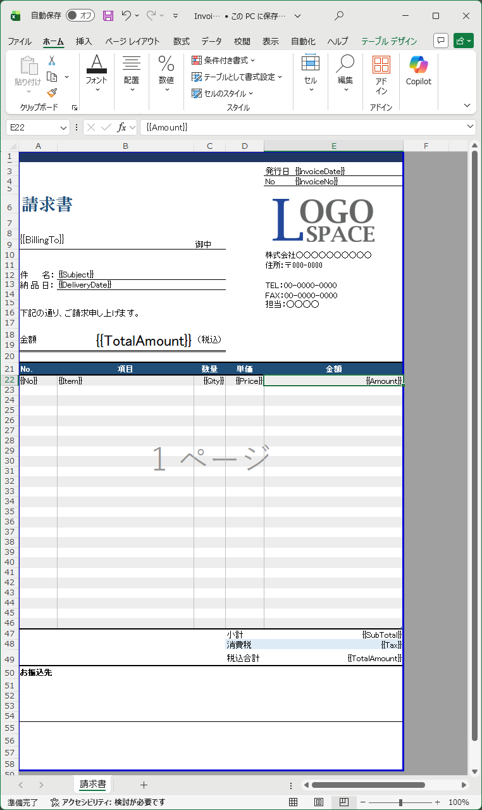
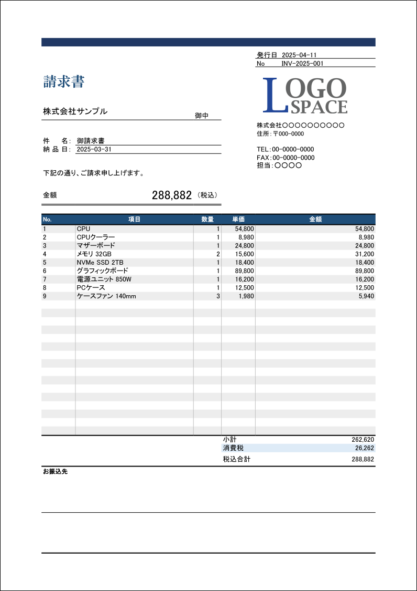

# OysterReport - Excel template to PDF converter

[](https://www.nuget.org/packages/OysterReport/)

## What is this?

A .NET library that converts Excel (.xlsx) templates to PDF.

| Excel |  | PDF |
| :---: | :---: | :---: |
|  | → |  |

## Quick Start

```csharp
var engine = new OysterReportEngine();

using var workbook = new TemplateWorkbook("Invoice.xlsx");
var sheet = workbook.GetSheet("Invoice");

// Replace simple placeholders
sheet.ReplacePlaceholders(new Dictionary<string, string?>
{
    ["CustomerName"] = "UsaUsa Corp",
    ["IssueDate"] = "2025-01-15"
});

// Fill detail rows sequentially from the marker positions
sheet.ReplacePlaceholders(items.Select(static item => new Dictionary<string, string?>
{
    ["ItemName"] = item.Name,
    ["Amount"] = item.Amount.ToString()
}));

using var output = File.Create("invoice.pdf");
engine.GeneratePdf(workbook, output);
```

## Supported features

| Category | Detail |
|---|---|
| **Font** | Size, Bold/Italic/Bold-Italic, Color |
| **Fill** | Background color |
| **Borders** | Border width, Custom color |
| **Text alignment** | Horizontal, Vertical |
| **Merged cells** | Horizontal, Vertical |
| **Images** | Cell-anchored and free-floating |
| **Page setup** | Paper size, Margins |
| **Header / footer** | Header and Footer text |
| **Multi-sheet** | Each sheet |
| **Print area** | Defined print area |
| **Embedded fonts** | Custom font resolver |

## Font settings

Font resolution is process-global, because PDFsharp resolves fonts through the
process-global `GlobalFontSettings`. Keep the following in mind:

- `OysterReportEngine.FontResolver` supplies fonts per engine, but registrations land in a
  process-global cache: registering the same font name with different data is last-one-wins
  across engines. Use one font configuration per process.
- On first render, OysterReport installs its resolver into `GlobalFontSettings.FontResolver`
  when the slot is free. If another component owns it, `FallbackFontResolver` is used instead,
  so both can coexist (the other component resolves first). If both slots are taken, fonts
  supplied by `FontResolver` cannot take effect and a `FontResolverNotInstalled` warning is
  raised through `ReportRenderOption.OnRenderWarning`.
- Registered font data stays in memory for the lifetime of the process. PDFsharp keeps its
  own copy of every font it has used and provides no way to release it, so OysterReport does
  not offer a release API either.

## Dependencies

- DocumentFormat.OpenXml
- [PDFsharp](https://github.com/empira/PDFsharp)
- [SkiaSharp](https://github.com/mono/SkiaSharp)
