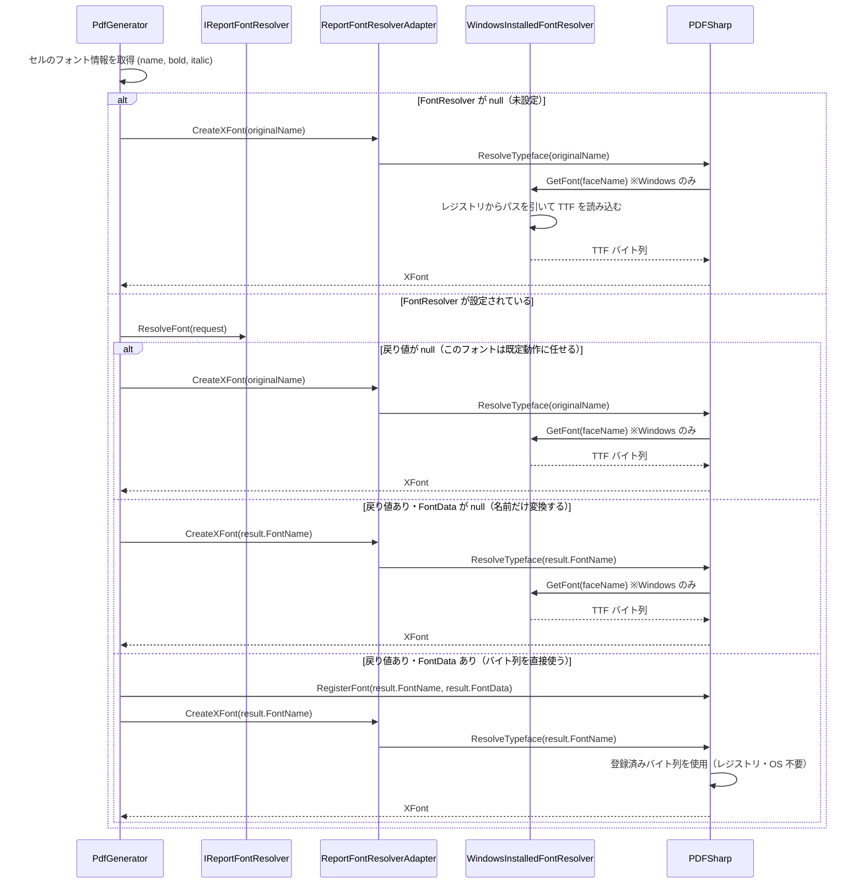
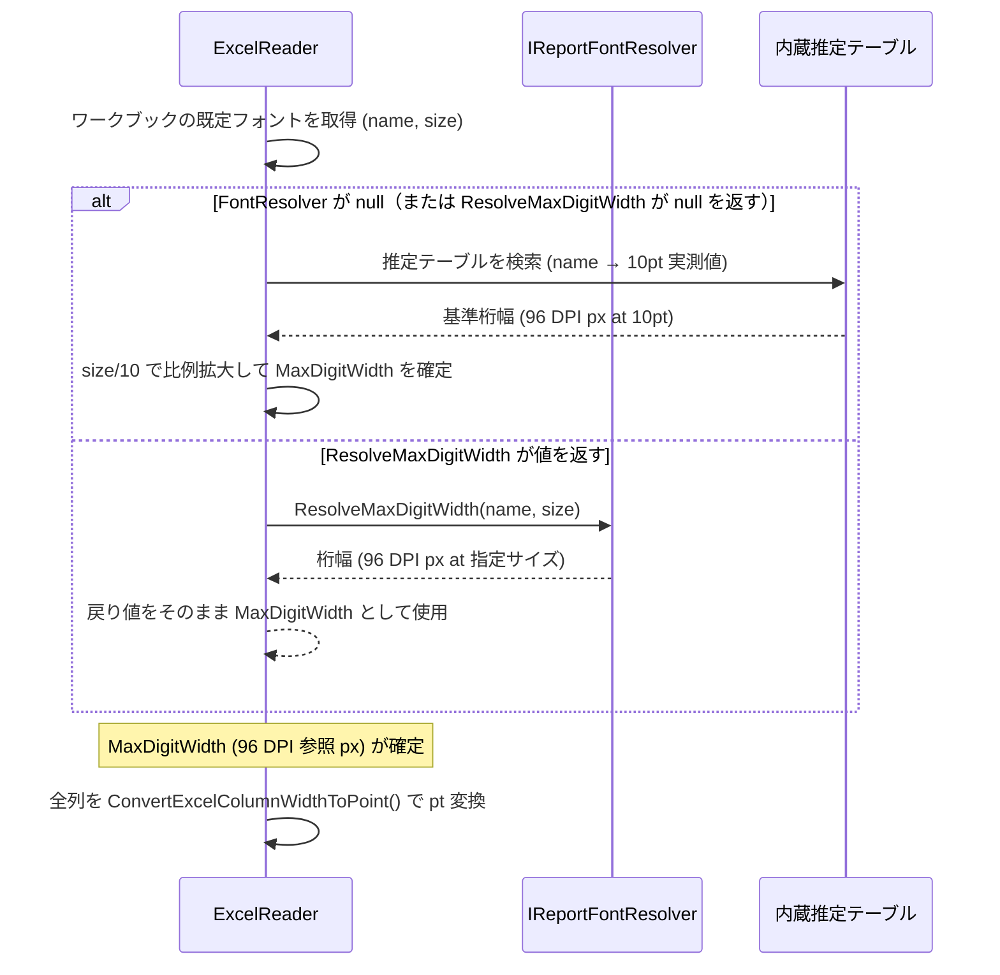

# フォントリゾルバー拡張設計書（改訂版）

## 1. 背景と目的

現在のフォント解決は以下の課題を持つ。

| 課題 | 現状 |
|---|---|
| フォントバイナリ配布不可 | `IReportFontResolver` はフォント名マッピングのみ。プロジェクト同梱の TTF バイト列を渡す手段がない |
| Windows への暗黙的依存 | `WindowsInstalledFontResolver` が `PdfGenerator` 内でリフレクション経由で自動登録される。非 Windows 環境では動作しない |
| フォント計測がハードコード | `ExcelReader` に `MeiryoDigitWidthAt10Pt` 等の固定定数が埋め込まれており、外部から提供できない |
| レンダリング定数が固定 | `PdfRenderingConstants` および `ExcelReader.ScreenDpi` 等が調整不可能 |
| API 設計の曖昧さ | `IsResolved` bool フラグ、`Resolve()` という動詞が何を返すか不明確 |

本設計ではこれらを解消し、**ライブラリが何もしなければ合理的な既定動作** をし、
**必要な箇所だけコールバックで上書き** できる設計にする。

---

## 2. MaxDigitWidth（最大桁幅）の仕様

`ResolveMaxDigitWidth` を正しく設計するために、まず Excel の列幅計算仕様を説明する。

### 2.1 Excel の列幅計算式（OOXML 仕様より）

Excel の列幅はポイントに変換される際、以下の式を使う。

```
padding = 2 × ceil(maxDigitWidth / 4) + 1   [px]

width < 1 の場合:
  pixelWidth = width × (maxDigitWidth + padding)

width ≥ 1 の場合:
  chars = (256 × width + round(128 / maxDigitWidth)) / 256
  pixelWidth = chars × maxDigitWidth + padding

pointWidth = pixelWidth × (72 / 96)         [px → pt 変換]
```

**`maxDigitWidth`** は "数字 0〜9 の中で最も広い文字を、96 DPI GDI デバイスコンテキストで描画した時のピクセル幅" である。

### 2.2 単位と DPI の関係

| 項目 | 説明 |
|---|---|
| 単位 | **96 DPI 参照ピクセル**（実行時のスクリーン DPI とは無関係） |
| `96` の意味 | Excel が仕様として固定した参照 DPI。実行環境の画面解像度ではない |
| サイズ依存性 | フォントサイズに比例する。10pt での実測値 × (目標サイズ / 10) で外挿可能 |
| 取得方法 | GDI32 の `GetCharWidth32()` を 96 DPI のビットマップ DC で呼び出すことで得られる |

`ScreenDpi = 96` は **式の定数**であり、ユーザーが調整すべき値ではない。

### 2.3 現在のハードコード値の根拠

以下の値は GDI 実測値（10pt、96 DPI 参照 DC）。

| フォント | 値 (px) | 備考 |
|---|---|---|
| Arial | 7.41536 | GDI 計測。欧文フォントの標準的な桁幅 |
| MS PGothic | 6.66667 ≈ 20/3 | 日本語プロポーショナルゴシック |
| Meiryo | 8.28125 | Vista 以降の標準 UI フォント。桁が広め |
| Yu Gothic | 8.5 | Windows 8.1 以降の標準フォント |
| 既定フォールバック | 7.0 | 未知フォントへの近似値 |

これらは本来、OS の GDI/DirectWrite API を実行時に呼び出して取得すべき値であるが、
クロスプラットフォーム動作のためハードコードしている。

---

## 3. 設計方針

### 3.1 IReportFontResolver は「既定動作の上書き」

```
null を返す（または FontResolver 未設定）
    → 既定動作: Windows ならインストール済みフォントを自動使用
               非 Windows なら PDFSharp 既定の解決にフォールバック

名前だけ返す（FontData = null）
    → 指定した名前でシステムフォントを検索する (Windows ならレジストリ参照)

名前 + バイト列を返す（FontData = bytes）
    → バイト列を直接 PDFSharp に登録し使用する。システム検索は行わない
```

### 3.2 ResolveFont の戻り値を nullable にする

`IsResolved` フラグは「null か否か」で代替できる。
`ReportFontResolveResult?` を返すことで、「解決しない」の意図が型レベルで表現される。

### 3.3 フォントデータを ResolveFont の結果に含める

旧設計案の `GetFontData()` メソッドを廃止し、`ReportFontResolveResult.FontData` に統合する。
「フォント名の決定」と「バイナリデータの供給」は同時に判断できるため、1 メソッドで完結させる。

---

## 4. 公開 API 設計

### 4.1 `IReportFontResolver`

```csharp
public interface IReportFontResolver
{
    /// フォントを解決する。
    /// null を返した場合は既定の解決にフォールバックする。
    /// 既定の解決: Windows ではインストール済みフォントを検索、非 Windows では PDFSharp 既定。
    ReportFontResolveResult? ResolveFont(ReportFontRequest request);

    /// 列幅計算用の最大桁幅を返す。
    /// 単位: 96 DPI 参照ピクセル (OOXML 列幅計算仕様に準拠、DPI に依存しない固定値)
    /// null を返した場合はライブラリ内蔵の推定テーブルを使用する。
    double? ResolveMaxDigitWidth(string fontName, double fontSizePoints) => null;
}
```

### 4.2 `ReportFontRequest`

変更なし。

```csharp
public sealed record ReportFontRequest
{
    public string FontName { get; init; } = string.Empty;
    public bool Bold { get; init; }
    public bool Italic { get; init; }
}
```

### 4.3 `ReportFontResolveResult`（再設計）

```csharp
public sealed record ReportFontResolveResult
{
    /// PDF で使用するフォントファミリー名。
    /// PDFSharp への登録名として使われる。FontData が null の場合はこの名前でシステム検索も行う。
    public string FontName { get; init; } = string.Empty;

    /// TTF/OTF バイト列。
    /// 指定した場合: このバイト列を FontName で PDFSharp に登録し、システム検索を行わない。
    /// null の場合: FontName でシステムフォントを検索する (Windows ならレジストリ、非 Windows なら PDFSharp 既定)。
    public ReadOnlyMemory<byte>? FontData { get; init; }

    /// 診断メッセージ（任意）。
    public string? Message { get; init; }
}
```

> `IsResolved` は廃止。`null` リターンで代替する。
> 旧 `ResolvedFontName` は `FontName` に改名する。

### 4.4 `ReportRenderingOptions`（新規）

```csharp
public sealed record ReportRenderingOptions
{
    // ---- セルテキスト描画 ----
    /// セル内テキストの左右余白 (pt)。Excel の見た目に合わせるための調整値。
    public double HorizontalCellTextPaddingPoints { get; init; } = 2d;

    /// セル内テキストの既定フォントサイズ (pt)。Excel で明示されていない場合に使用。
    public double DefaultCellFontSizePoints { get; init; } = 11d;

    // ---- ヘッダー/フッター ----
    /// ヘッダー/フッターの既定フォントサイズ (pt)。
    public double HeaderFooterFontSizePoints { get; init; } = 9d;

    /// ヘッダー/フッター描画時のフォールバック候補一覧。
    public IReadOnlyList<string> HeaderFooterFallbackFontNames { get; init; } =
        ["Arial", "Segoe UI", "Helvetica", "Liberation Sans", "DejaVu Sans"];

    // ---- 罫線 ----
    public double ThickBorderWidthPoints  { get; init; } = 2.25d;
    public double MediumBorderWidthPoints { get; init; } = 1.5d;
    public double NormalBorderWidthPoints { get; init; } = 0.75d;
    public double HairBorderWidthPoints   { get; init; } = 0.25d;

    // ---- 列幅計算 ----
    /// 列幅ポイント変換時の補正係数。全列の幅に乗算される (既定: 1.0)。
    public double ColumnWidthAdjustment { get; init; } = 1d;

    /// 未知フォントに使用するフォールバック最大桁幅 (96 DPI 参照ピクセル)。
    public double FallbackMaxDigitWidth { get; init; } = 7d;
}
```

> `ScreenDpi` は OOXML 仕様の固定定数 (96) であるため外部公開しない。

### 4.5 `OysterReportEngine`

```csharp
public sealed class OysterReportEngine
{
    public IReportFontResolver? FontResolver { get; set; }
    public bool EmbedDocumentMetadata { get; set; } = true;
    public bool CompressContentStreams { get; set; } = true;

    /// レンダリング調整値。null の場合は全て既定値を使用する。
    public ReportRenderingOptions? RenderingOptions { get; set; }

    public void GeneratePdf(TemplateWorkbook template, Stream output);
    public void GeneratePdf(TemplateSheet sheet, Stream output);
}
```

---

## 5. フォント選択シーケンス

### 5.1 PDF 描画時のフォント解決フロー



### 5.2 列幅計算時のフォント計測フロー



### 5.3 フォントデータの有無による挙動の対応表

| `ResolveFont` の戻り値 | `FontData` | 挙動 | 動作プラットフォーム |
|---|---|---|---|
| `null` | — | 既定解決（Windows: レジストリ検索） | Windows のみ |
| `{ FontName = "Arial" }` | `null` | "Arial" でシステム検索 | Windows のみ |
| `{ FontName = "NotoSansJP", FontData = bytes }` | バイト列 | バイト列を PDFSharp に登録して使用 | クロスプラットフォーム |

---

## 6. 内部設計

### 6.1 ReportFontResolverAdapter (新規)

```
PdfSharp.Fonts.IFontResolver
    ↑ 実装
ReportFontResolverAdapter (internal)
    │
    ├── ResolveTypeface(family, bold, italic)
    │     1. IReportFontResolver.ResolveFont() を呼ぶ
    │     2a. null → originalName でフォールバック (WindowsInstalledFontResolver)
    │     2b. FontData あり → キャッシュ登録し faceName を返す
    │     2c. FontData なし → result.FontName を faceName として返す
    │
    └── GetFont(faceName)
          1. FontData キャッシュを確認 → あればそのバイト列を返す
          2. なければ WindowsInstalledFontResolver.GetFont(faceName) に委譲
             (Windows 以外では例外またはフォールバック)
```

`EnsurePdfSharpFontConfiguration()` は `ReportFontResolverAdapter` を登録するよう変更する。
これにより `WindowsInstalledFontResolver` の直接登録が廃止される。

### 6.2 ReportRenderContext の変更

```csharp
internal sealed record ReportRenderContext
{
    public ReportWorkbook Workbook { get; init; } = new();
    public IReadOnlyList<PdfRenderSheetPlan> SheetPlans { get; init; } = [];
    public IReportFontResolver? FontResolver { get; init; }
    public bool EmbedDocumentMetadata { get; init; } = true;
    public bool CompressContentStreams { get; init; } = true;
    public ReportRenderingOptions RenderingOptions { get; init; } = new(); // 追加
}
```

### 6.3 PdfRenderingConstants の整理

| 定数 | 変更後の扱い |
|---|---|
| `HorizontalCellTextPaddingPoints` | `ReportRenderingOptions` へ移動 |
| `DefaultCellFontSizePoints` | `ReportRenderingOptions` へ移動 |
| `HeaderFooterFontSizePoints` | `ReportRenderingOptions` へ移動 |
| `ThickBorderWidthPoints` 等罫線幅 | `ReportRenderingOptions` へ移動 |
| `MinimumDoubleBorderGapPoints` | 内部定数として残す（ユーザー調整不要） |
| `DoubleBorderGapWidthMultiplier` | 内部定数として残す |
| `StraightLineTolerancePoints` | 内部定数として残す |

---

## 7. 使用例

### 7.1 プロジェクト同梱 TTF でクロスプラットフォーム動作

```csharp
// Fonts/NotoSansJP-Regular.ttf をプロジェクトに含めて配布するケース
public class EmbeddedFontResolver : IReportFontResolver
{
    private static readonly ReadOnlyMemory<byte> NotoSansJpBytes =
        File.ReadAllBytes("Fonts/NotoSansJP-Regular.ttf");

    public ReportFontResolveResult? ResolveFont(ReportFontRequest request)
    {
        if (IsJapaneseGothic(request.FontName))
        {
            return new ReportFontResolveResult
            {
                FontName = "Noto Sans JP",
                FontData = NotoSansJpBytes
                // FontName は PDFSharp 内での登録名として使われる
            };
        }
        // null → その他は既定動作 (Windows: レジストリ検索)
        return null;
    }

    public double? ResolveMaxDigitWidth(string fontName, double fontSizePoints)
    {
        if (IsJapaneseGothic(fontName))
        {
            // Noto Sans JP の 96 DPI 実測値 (10pt 基準) × サイズ比
            const double notoSansJpAt10Pt = 8.0;
            return notoSansJpAt10Pt * (fontSizePoints / 10.0);
        }
        // null → ライブラリ内蔵の推定テーブルを使用
        return null;
    }

    private static bool IsJapaneseGothic(string name) =>
        name.Contains("ゴシック") || name.Contains("Gothic", StringComparison.OrdinalIgnoreCase);
}
```

### 7.2 Windows フォントのみ使う（現行の JapaneseFontResolver に相当）

```csharp
// FontData を返さない → PDFSharp が WindowsInstalledFontResolver 経由でレジストリ検索する
public class JapaneseFontResolver : IReportFontResolver
{
    private static readonly Dictionary<string, string> FontMap = new(StringComparer.OrdinalIgnoreCase)
    {
        ["ＭＳ Ｐゴシック"] = "MS PGothic",
        ["ＭＳ ゴシック"]   = "MS Gothic",
        ["ＭＳ Ｐ明朝"]     = "MS PMincho",
    };

    public ReportFontResolveResult? ResolveFont(ReportFontRequest request)
    {
        if (FontMap.TryGetValue(request.FontName, out var resolved))
        {
            return new ReportFontResolveResult { FontName = resolved };
            // FontData = null → PDFSharp が Windows レジストリで resolved を検索する
        }
        // null → 元のフォント名でそのままレジストリ検索
        return null;
    }

    // ResolveMaxDigitWidth は実装しない → DIM 既定の null → ライブラリ内蔵推定値を使用
}
```

### 7.3 レンダリング調整

```csharp
var engine = new OysterReportEngine
{
    FontResolver = new EmbeddedFontResolver(),
    RenderingOptions = new ReportRenderingOptions
    {
        ColumnWidthAdjustment = 1.05d,
        HorizontalCellTextPaddingPoints = 3d,
        FallbackMaxDigitWidth = 7.5d
    }
};
```

---

## 8. 実装計画

| ステップ | 対象 | 内容 |
|---|---|---|
| 1 | `ReportFontResolveResult` | `IsResolved` 削除、`FontData` 追加、`ResolvedFontName` → `FontName` |
| 2 | `IReportFontResolver` | `Resolve()` → `ResolveFont()`（nullable 返却）、`ResolveMaxDigitWidth()` を DIM で追加 |
| 3 | `ReportRenderingOptions` | 新規作成 |
| 4 | `ReportFontResolverAdapter` | 新規作成。`IFontResolver` 実装、フォントデータキャッシュ管理 |
| 5 | `PdfGenerator` | `EnsurePdfSharpFontConfiguration()` を `ReportFontResolverAdapter` 登録に変更。`PdfRenderingConstants` 参照を `RenderingOptions` 経由に変更 |
| 6 | `ExcelReader` | `ResolveMaxDigitWidth()` 呼び出しを追加。`ScreenDpi` を内部定数に留める |
| 7 | `PdfRenderPlanner` | `HorizontalCellTextPaddingPoints` 等を `RenderingOptions` 経由に変更 |
| 8 | `ReportRenderContext` | `RenderingOptions` フィールド追加 |
| 9 | `OysterReportEngine` | `RenderingOptions` プロパティ追加、`CreateRenderContext` に渡す |
| 10 | `PdfRenderingConstants` | 外部化した定数を削除し内部専用定数のみ残す |
| 11 | `JapaneseFontResolver` (Example) | 新 API へ移行 |
| 12 | テスト | 各ステップのユニットテスト追加 |
